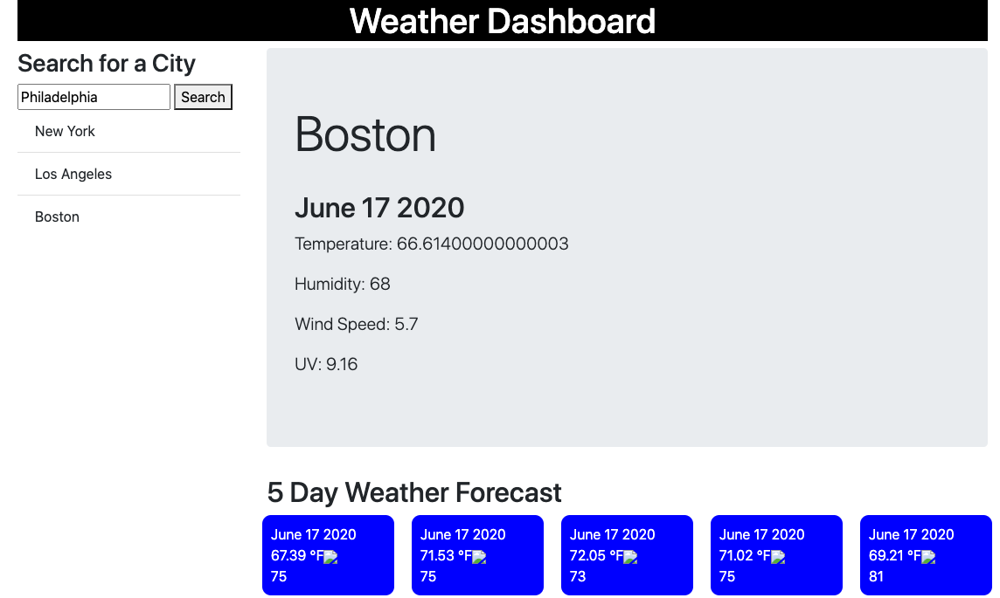

# Weather-Dashboard

Get the weather whenever, where ever!

___

## Description

This weather dashboard application is designed to allow the user to be able to view the current weather data as well as a detailed 5 day forecast for the city of their choosing.
___

## How It Works

The weather app dashboard used a number of skills to showcase a finished product that is functional. This assignment began with researching the Open Weather Map API. This API allowed me to gather the required information such as the temperature, humidity, and wind speed. An additional feature was the UV Index information that was found through a separate API. This additional API has its own query, ajax call, and method to "get" the needed information in the same manner as the aforementioned data.

Upon opening the app, the user will be given the weather for a popular city in the main display. From there, the user can type in their desired city and click "search". Once the search displays, the user will be shown the current day's weather information as well as the next 5 days of weather information with an icon that corresponds to the particular weather for that day.

Once the user has decided viewed the forecast, they will be able to search for additional cities in the same manner as before. However, the previous city will be stored into local storage and displayed in a list on the left hand portion of the screen.  This allows the user to easily access past searches without having to retype the city in which they wish to view.

___

## Link to Project

https://ccraig7321.github.io/Weather-Dashboard/

___

## Technologies

- HTML
- CSS
- JQuery
- Bootstrap
- Visual Studio Code
- Open Weather Map API

___

### License

Copyright 2020 CHELSEY CRAIG

Permission is hereby granted, free of charge, to any person obtaining a copy of this software and associated documentation files (the "Software"), to deal in the Software without restriction, including without limitation the rights to use, copy, modify, merge, publish, distribute, sublicense, and/or sell copies of the Software, and to permit persons to whom the Software is furnished to do so, subject to the following conditions:

The above copyright notice and this permission notice shall be included in all copies or substantial portions of the Software.

THE SOFTWARE IS PROVIDED "AS IS", WITHOUT WARRANTY OF ANY KIND, EXPRESS OR IMPLIED, INCLUDING BUT NOT LIMITED TO THE WARRANTIES OF MERCHANTABILITY, FITNESS FOR A PARTICULAR PURPOSE AND NONINFRINGEMENT. IN NO EVENT SHALL THE AUTHORS OR COPYRIGHT HOLDERS BE LIABLE FOR ANY CLAIM, DAMAGES OR OTHER LIABILITY, WHETHER IN AN ACTION OF CONTRACT, TORT OR OTHERWISE, ARISING FROM, OUT OF OR IN CONNECTION WITH THE SOFTWARE OR THE USE OR OTHER DEALINGS IN THE SOFTWARE.